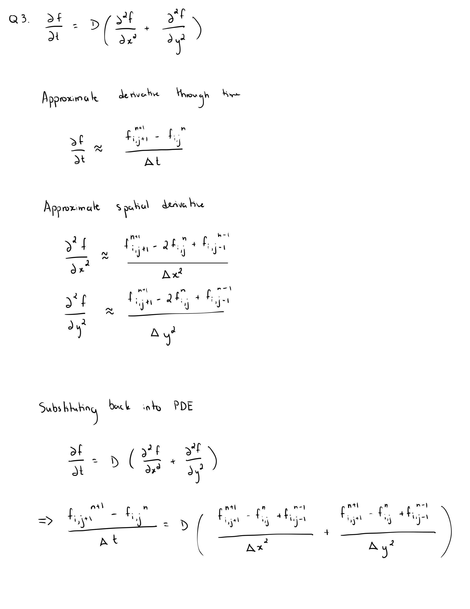
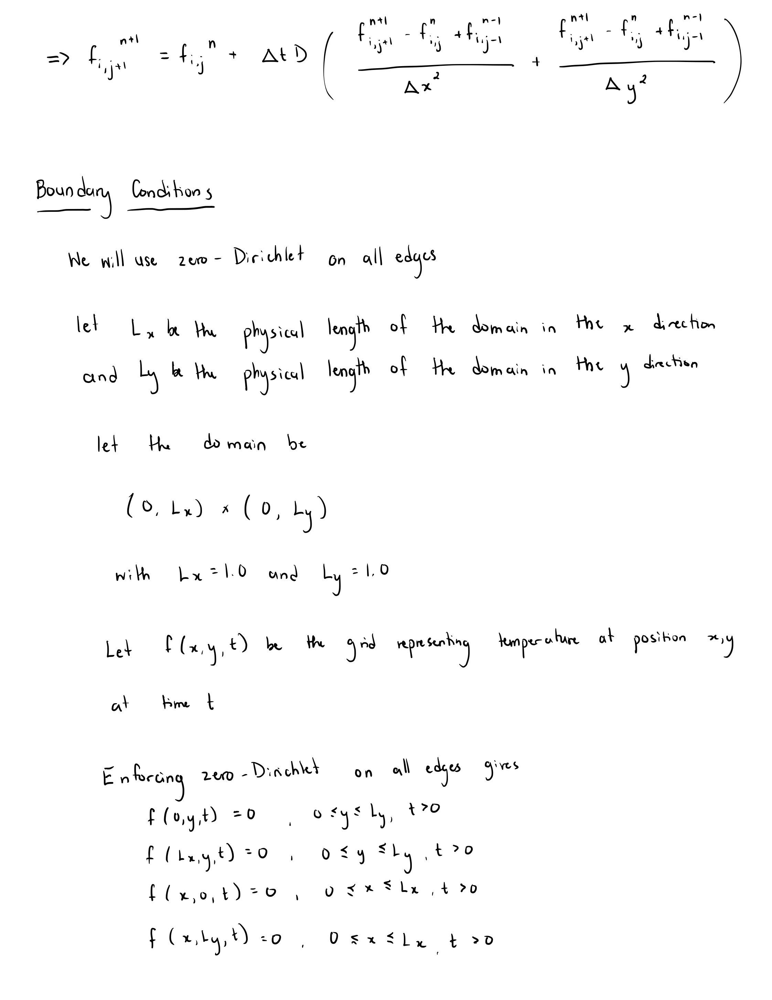

Derivation:

I wrote a program simulating the diffusion process in `diffusion_approx.cpp`. 

To compile, run `g++ -o diffusion_approx diffusion_approx.cpp` and then run the executable, `./diffusion_approx`.